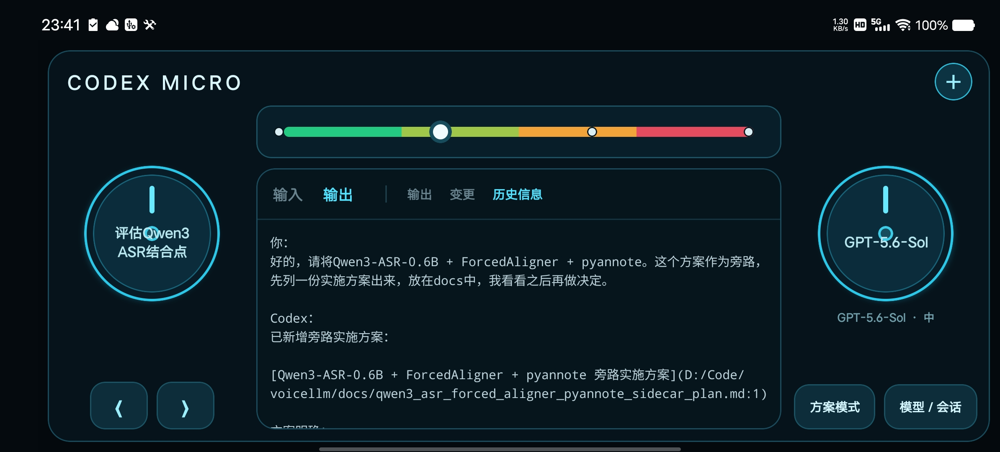
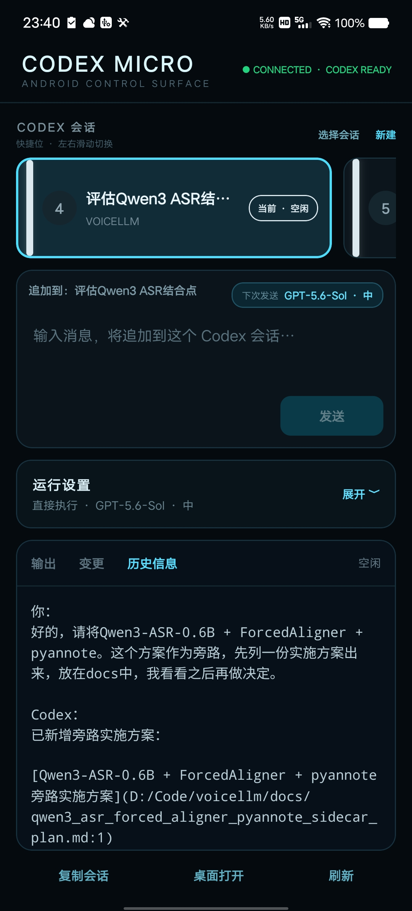

# Codex Micro

Codex Micro 是一个 Android 控制面板。Codex 和登录凭据保留在电脑端，手机只连接 Companion 暴露的稳定协议。

完整的安装、启动、配对、真机调试和故障排查请参阅：[启动手册](启动手册.md)。

## 截图

<p align="center">
  
</p>

<p align="center">
  
</p>

## 已实现

- Windows Companion 启动并自动重启 `codex app-server`，完成 JSON-RPC 初始化。
- Companion 适配当前 Codex Schema，将线程、Turn、消息、Diff 和审批转换为自有协议。
- 一次性二维码/配对码、256-bit 设备令牌、令牌哈希保存和设备撤销。
- SQLite 持久化设备、十个任务 Slot、待审批、幂等键和最近 5000 个事件。
- WebSocket 鉴权、事件序号、同一 Server Epoch 内增量回放和跨重启 Snapshot。
- Android 扫码/手工配对，令牌存入 SecureStore，连接游标存入 SQLite。
- 最近十个 Codex 会话自动分配到任务转盘和首页横条；支持搜索完整会话列表、重新分配任务位和按工作目录新建会话。
- 查看流式输出和 Diff；发送、Steer、停止、Fork、Approve、Decline、桌面打开。
- 从 Codex `model/list` 动态读取模型、按模型约束 Reasoning effort、明确的直接执行/先给方案模式、会话切换、触觉反馈和前台常亮。

Android 不保存 ChatGPT/Codex 凭据，也不直接暴露 Codex App Server 端口。

## 环境

- Node.js 22 或更高（已在 Node 24.16 验证）
- pnpm 11.8（由 Corepack 管理）
- Codex CLI，且电脑端已经登录
- Android SDK、JDK 17、USB 调试设备（构建 Development Build 时需要）

## 启动 Companion

```powershell
cd D:\Code\codexcontrol
corepack pnpm install
$env:MICRO_PUBLIC_HOST = "192.168.1.10" # 改成电脑局域网或 Tailscale 地址
corepack pnpm dev:companion
```

终端会显示二维码和配对码。健康检查：

```powershell
Invoke-RestMethod http://127.0.0.1:8787/health
```

列出和撤销设备：

```powershell
Invoke-RestMethod http://127.0.0.1:8787/devices
Invoke-RestMethod -Method Delete http://127.0.0.1:8787/devices/<deviceId>
```

## USB 真机开发

```powershell
adb reverse tcp:8787 tcp:8787
adb reverse tcp:8083 tcp:8081
corepack pnpm android
```

USB 反向代理时，App 中填 `http://127.0.0.1:8787`。局域网调试则填 Companion 打印的电脑 IP。

## 构建 APK

```powershell
corepack pnpm --filter @codex-micro/mobile exec expo prebuild --platform android
cd apps\mobile\android
.\gradlew.bat assembleDebug
adb install -r app\build\outputs\apk\debug\app-debug.apk
```

无需 Metro 的独立测试包：

```powershell
cd apps\mobile\android
.\gradlew.bat assembleRelease
adb install -r app\build\outputs\apk\release\app-release.apk
```

当前 Android 构建只生成 `arm64-v8a`，用于减少真机包体积和原生编译时间。
本次验证生成的 Development APK 位于 `artifacts/codex-micro-0.1.0-debug-arm64.apk`；运行它仍需启动 Metro，并配置上文的 USB 反向代理。

仓库内包含 Expo Autolinking 的 Windows 补丁，用于阻止系统 `cmd AutoRun` 输出污染 Autolinking JSON。该补丁由 pnpm 自动应用。

## 验证

```powershell
corepack pnpm typecheck
corepack pnpm test
corepack pnpm build
```

## 网络与安全

`usesCleartextTraffic` 只用于 Development Build 的 LAN/USB 调试。生产使用应通过 Tailscale，或由 Caddy/Nginx 在 Companion 前提供 WSS，并在 release 配置中禁用明文流量。不要把 `8787` 或 Codex App Server 直接暴露到公网。

## 已知问题：移动端与官方桌面端会话同步

如果通过 ChatGPT/Codex 移动端的 Remote Control 向官方 Codex 桌面端线程发送消息，桌面端偶尔不会及时刷新会话记录：移动端已经收到答复，但桌面端仍显示旧内容，通常需要重新打开或重启桌面端应用后才会出现新消息。

这是上游 Codex Desktop 的会话同步问题，不是本项目配对、WebSocket 或任务协议导致的。临时处理方式是重新打开对应线程；如果仍未更新，再重启 Codex 桌面端。相关反馈见 [openai/codex#22773](https://github.com/openai/codex/issues/22773)。

## 当前边界

- 官方桌面客户端和手机不会实时共同编辑同一个正在运行的 Turn；`OPEN DESKTOP` 通过 `codex://threads/<id>` 打开对应线程。
- Android WebSocket 保证前台实时；Doze 下不承诺后台常驻。生产推送通道需绑定具体的 FCM/APNs 部署凭据。
- 当前语音入口未绑定云端服务。选择本地 SpeechRecognizer 或 Companion 端 Whisper/FunASR 后，可在不改变现有协议边界的情况下增加 Push-to-talk。
- macOS 桌面打开路径已兼容，Windows Android 真机是本版本的主要验收平台。
