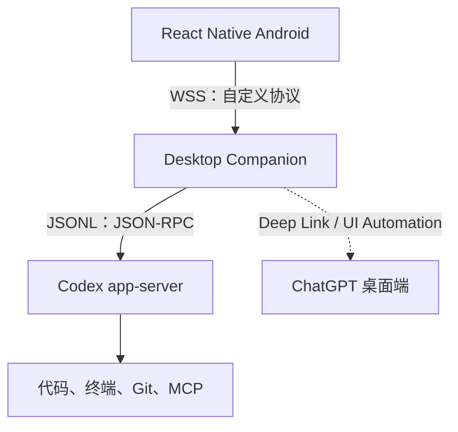
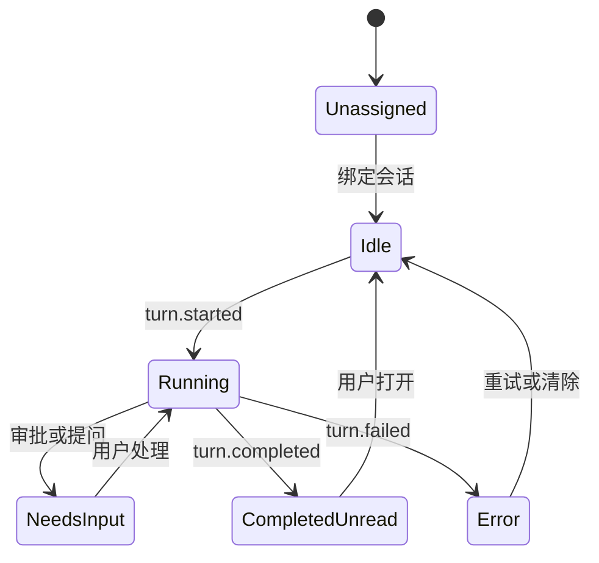

可以。建议第一版明确为：

> Android React Native App 作为 Codex 控制面板；电脑运行 Companion 服务和 Codex App Server。Android 不保存 ChatGPT 凭据，也不直接连接不稳定的 Codex 内部协议。

这样能独立实现，不复用 CodexDroid 或 codexapp 的代码，只参考它们“移动端 + 桥接层 + App Server”的架构思想。

## 一、先明确一个边界

公开的 `codex app-server` 能控制 Codex 引擎、会话、执行、审批和流式事件，但没有公开接口让第三方 App 直接附着到“官方 ChatGPT 桌面客户端正在使用的那个进程”。

因此第一版应定义为：

* Android 能创建、恢复、控制 Codex 会话。
* Codex 在电脑环境中运行，能访问电脑上的代码、终端、Git 和 MCP。
* Android 能查看状态、输出、Diff 和审批请求。
* 可通过 `codex://threads/<thread-id>` 在官方桌面端打开对应会话。
* 不承诺 Android 和官方桌面界面实时双向编辑同一个正在运行的 Turn。

后续如果一定要完全复刻实体 Micro 对桌面客户端的操控，再增加 Windows UI Automation/macOS Accessibility 适配器。

---

# 二、推荐技术栈

当前 React Native 官方版本为 0.86，原生支持 WebSocket；Expo 当前模板可提供匹配的 RN 版本。[React Native 网络文档](https://reactnative.dev/docs/network)

### Android App

* React Native + TypeScript
* Expo SDK 57
* Expo Development Build，不使用 Expo Go
* Expo Router
* React Native Gesture Handler
* React Native Reanimated
* Shopify React Native Skia：做键盘光效、旋钮、摇杆
* Zustand：界面状态
* 自定义纯函数 Reducer：处理来自 Companion 的领域事件
* `expo-sqlite`：会话、Slot、未读状态、事件游标
* `expo-secure-store`：设备令牌
* `expo-camera`：扫码配对
* `expo-keep-awake`：桌面控制器模式常亮
* `expo-haptics`：按键、旋钮刻度反馈
* `expo-audio`：按住说话

Expo Development Build 可以加入自定义 Android 原生模块，后续实现前台服务、Android SpeechRecognizer 等能力；CNG/Prebuild 则能避免长期手工维护 Android 工程。[Development Build](https://docs.expo.dev/develop/development-builds/introduction/)、[CNG/Prebuild](https://docs.expo.dev/workflow/continuous-native-generation/)

### 电脑端 Companion

建议同样使用 TypeScript：

* Node.js 22
* Fastify
* `ws`
* Zod
* SQLite
* Node `child_process`
* Codex CLI/App Server

这样移动端、Companion 和协议包可以共享 TypeScript 类型。

---

# 三、工程结构

```text
codex-micro/
├─ apps/
│  ├─ mobile/                    # React Native Android
│  │  ├─ app/                    # Expo Router
│  │  └─ src/
│  │     ├─ features/
│  │     │  ├─ controller/       # Codex Micro 主面板
│  │     │  ├─ threads/          # 会话列表与详情
│  │     │  ├─ approvals/        # 审批弹窗
│  │     │  ├─ composer/         # 文字和语音输入
│  │     │  ├─ pairing/          # QR 配对
│  │     │  └─ settings/
│  │     ├─ domain/
│  │     │  ├─ reducer.ts
│  │     │  ├─ slot-state.ts
│  │     │  └─ models.ts
│  │     ├─ infrastructure/
│  │     │  ├─ websocket/
│  │     │  ├─ sqlite/
│  │     │  └─ secure-store/
│  │     └─ components/
│  │
│  └─ companion/                 # 电脑端桥接程序
│     └─ src/
│        ├─ codex/
│        │  ├─ process.ts
│        │  ├─ json-rpc.ts
│        │  ├─ event-normalizer.ts
│        │  └─ approval-broker.ts
│        ├─ gateway/
│        │  ├─ websocket.ts
│        │  ├─ pairing.ts
│        │  └─ replay-buffer.ts
│        ├─ desktop/
│        │  ├─ windows.ts
│        │  └─ macos.ts
│        └─ persistence/
│
├─ packages/
│  ├─ protocol/                  # 手机与 Companion 的稳定协议
│  ├─ domain/                    # Slot、状态机、公共模型
│  └─ config/
│
├─ fixtures/
│  └─ codex-events/              # 脱离 Codex 也能测试 UI
└─ pnpm-workspace.yaml
```

最重要的是：`packages/protocol` 定义的是你自己的协议，而不是把 Codex JSON-RPC 原样传给 Android。

---

# 四、通信架构



Companion 启动 Codex：

```ts
const child = spawn(
  "codex",
  ["app-server", "--listen", "stdio://"],
  {
    stdio: ["pipe", "pipe", "inherit"],
    env: process.env,
  },
);
```

然后执行初始化：

```json
{
  "method": "initialize",
  "id": 1,
  "params": {
    "clientInfo": {
      "name": "codex_micro_companion",
      "title": "Codex Micro Companion",
      "version": "0.1.0"
    }
  }
}
```

```json
{
  "method": "initialized",
  "params": {}
}
```

之所以使用 stdio，而不是让 Android 直接连接 App Server WebSocket：

* Codex WebSocket 目前仍属于实验接口。
* Companion 可以屏蔽不同 Codex 版本的 Schema 变化。
* ChatGPT 登录凭据不离开电脑。
* 审批、重连、事件回放更容易管理。
* 后续可以同时适配 Codex、Claude Code、Pi Agent。

[Codex App Server 官方文档](https://developers.openai.com/codex/app-server)

---

# 五、手机与 Companion 的协议

建议所有服务端事件包含：

```ts
type EventEnvelope<T> = {
  protocolVersion: 1;
  serverEpoch: string;
  seq: number;
  sentAt: number;
  event: T;
};
```

`serverEpoch` 标识 Companion 是否重启；`seq` 用于断线续传。

### Android 发出的命令

```ts
type ClientCommand =
  | {
      type: "auth";
      deviceId: string;
      accessToken: string;
      lastSeq: number;
    }
  | {
      type: "thread.list";
      requestId: string;
    }
  | {
      type: "slot.assign";
      slotId: number;
      threadId: string | null;
    }
  | {
      type: "turn.start";
      requestId: string;
      idempotencyKey: string;
      threadId: string;
      text: string;
      effort?: "low" | "medium" | "high" | "xhigh";
    }
  | {
      type: "turn.steer";
      requestId: string;
      threadId: string;
      turnId: string;
      text: string;
    }
  | {
      type: "turn.interrupt";
      requestId: string;
      threadId: string;
      turnId: string;
    }
  | {
      type: "approval.respond";
      requestId: string;
      approvalRequestId: string;
      decision: "accept" | "acceptForSession" | "decline" | "cancel";
    }
  | {
      type: "desktop.openThread";
      threadId: string;
    };
```

### Companion 发出的领域事件

```ts
type ServerEvent =
  | { type: "snapshot"; state: ControllerSnapshot }
  | { type: "slot.updated"; slot: AgentSlot }
  | { type: "turn.started"; threadId: string; turnId: string }
  | { type: "turn.completed"; threadId: string; status: TurnStatus }
  | { type: "message.delta"; threadId: string; itemId: string; text: string }
  | { type: "diff.updated"; threadId: string; diff: string }
  | { type: "approval.requested"; approval: ApprovalRequest }
  | { type: "approval.resolved"; approvalRequestId: string }
  | { type: "connection.health"; codex: "ready" | "restarting" | "error" };
```

不要把 `item/commandExecution/requestApproval` 等 Codex 原始事件直接暴露给移动端。

---

# 六、六个 Agent Slot 状态机



```ts
type AgentSlotState =
  | "unassigned"
  | "idle"
  | "running"
  | "needs_input"
  | "completed_unread"
  | "error";

type AgentSlot = {
  slotId: 1 | 2 | 3 | 4 | 5 | 6;
  threadId: string | null;
  title: string | null;
  projectName: string | null;
  state: AgentSlotState;
  selected: boolean;
  updatedAt: number;
};
```

颜色遵循实体 Micro：

| 状态                 | 颜色  |
| ------------------ | --- |
| `idle`             | 白色  |
| `running`          | 蓝色  |
| `completed_unread` | 绿色  |
| `needs_input`      | 琥珀色 |
| `error`            | 红色  |
| `unassigned`       | 熄灭  |

“未读”必须由我们维护。收到 `turn.completed` 时，如果不是当前选中 Slot，则置为绿色；用户点击后清除。

---

# 七、Android 界面设计

第一版建议横屏优先，但不能强制只支持横屏。

### 主控制面板

* 顶部：连接状态、电脑名、当前项目、设置。
* 中部：2×3 Agent Slot。
* 下部：Fast、Approve、Decline、Fork、Mic、Send。
* 左侧：虚拟摇杆。
* 右侧：Reasoning 旋钮。
* 底部抽屉：当前会话输出、Diff 和审批详情。

### 旋钮

使用 Gesture Handler 获取拖动角度：

```ts
const angle = Math.atan2(y - centerY, x - centerX);
```

将角度映射成：

```text
low → medium → high → xhigh
```

每跨过一个刻度调用一次 Haptics。

注意：旋钮只能设置后续 `turn/start` 的 effort，不能改变已经开始执行的 Turn。

### 摇杆

* 中心死区：35%
* 上：Plan Mode
* 下：显示/隐藏详情
* 左：上一会话
* 右：下一会话

第一版不必实现真正连续模拟量，只需识别四个方向。

---

# 八、语音输入

Android 第一版建议使用按住说话，而不是持续监听。

两种实现：

### 方案 A：Android SpeechRecognizer

优点：

* 延迟低。
* 可以返回临时转写。
* 可尝试设备端识别。

缺点：

* 不同品牌手机表现不同。
* 某些实现会把音频发送到远端。
* 官方明确不建议用于持续识别。

适合第一版 Push-to-talk。[Android SpeechRecognizer](https://developer.android.com/reference/android/speech/SpeechRecognizer)

需要写一个很小的 Expo Android Module：

```text
modules/
└─ speech-recognizer/
   ├─ android/
   │  └─ SpeechRecognizerModule.kt
   └─ src/
      └─ index.ts
```

### 方案 B：录音后交给 Companion 转写

* Android 使用 `expo-audio` 录制。
* 上传 M4A/Opus。
* Companion 调本地 Whisper、FunASR 或 OpenAI 转写。
* 识别结果回填输入框，用户确认后发送。

这个方案可控性更强，建议第二阶段实现。[Expo Audio](https://docs.expo.dev/versions/latest/sdk/audio/)

---

# 九、配对与安全

### 配对流程

1. Companion 生成一次性配对码。
2. 在电脑显示二维码。
3. Android 用 Camera 扫码。
4. Android 提交配对码和随机生成的 `deviceId`。
5. Companion 签发 256-bit 设备令牌。
6. Android 存入 SecureStore。
7. Companion 只保存令牌哈希。

二维码内容：

```json
{
  "version": 1,
  "host": "wss://desktop.example.ts.net/micro",
  "pairingCode": "742-918",
  "expiresAt": 1784246400000
}
```

不要在二维码里放 ChatGPT Token、Codex Access Token 或长期 Companion Token。

### 网络方式

开发阶段：

```bash
adb reverse tcp:8787 tcp:8787
```

真机局域网调试可以暂时使用 `ws://`，但 Android API 28+ 默认阻止明文流量，应只在 debug manifest 中允许。[React Native Android 网络说明](https://reactnative.dev/docs/network)

正式使用：

* 优先 Tailscale。
* 或 Caddy/Nginx 提供 WSS。
* 不要直接把 App Server 端口暴露到互联网。

---

# 十、断线恢复

这是项目中非常关键的一部分。

Android 重连时发送：

```json
{
  "type": "auth",
  "deviceId": "android-01",
  "accessToken": "***",
  "lastSeq": 1842
}
```

Companion：

* 如果事件缓存仍包含 `1843...current`，进行增量重放。
* 如果 Companion 已重启或事件过旧，发送完整 `snapshot`。
* 所有命令携带 `idempotencyKey`，防止断线重发两次 Prompt 或两次批准。
* 审批请求在 Companion 持久化到 SQLite，直到被解决。
* Companion 重启后重新查询线程和活动状态。

Android 后台不应该长期维持普通 WebSocket。Doze/App Standby 会限制后台网络；第一版仅保证前台控制台模式实时连接，后台采用通知而不是永久 Socket。[Android Doze 说明](https://developer.android.com/training/monitoring-device-state/doze-standby)

---

# 十一、从两个项目中借鉴什么

只借鉴模式，不复用代码。

### 从 CodexDroid 借鉴

* 移动端分离 UI、Domain、Data。
* Connection、Thread 本地持久化。
* 使用单向状态流驱动界面。
* 协议测试和固定 Event Fixture。

### 从 codexapp 借鉴

* 移动端不直接持有 Codex 登录凭据。
* 电脑端桥接 App Server。
* 移动端和 Codex 协议之间存在转换层。
* 支持 LAN、远程主机和 Tunnel。

### 不借鉴

* 不直接连接第三方 `codex-app-server` npm 包。
* 不把 App Server 原始 JSON-RPC 暴露给手机。
* 不从 Codex 会话文件中手工解析状态。
* 不让移动端依赖某个 Codex CLI 版本的类型。
* 不在手机上通过 Termux 运行整个 Codex。

---

# 十二、实施阶段

## Phase 0：协议验证，2～3天

只写 Companion：

* 启动 App Server。
* 完成 initialize。
* `thread/list`。
* `thread/resume`。
* `turn/start`。
* 接收消息增量、Turn 完成和审批请求。
* 保存原始事件 Fixture。

验收标准：命令行输入一个 Prompt，Companion 能完整打印执行过程。

## Phase 1：Android MVP，5～7天

* Expo Development Build。
* QR 配对。
* WebSocket 连接。
* 六个 Slot。
* 会话选择。
* 文字输入和发送。
* 蓝/绿/黄/红状态。
* Approve/Decline。
* 断线重连和 Snapshot。

验收标准：不接触电脑键盘，可以从 Android 发起任务、查看执行并批准命令。

## Phase 2：Micro 交互，3～5天

* 旋钮。
* 摇杆。
* 双击、长按。
* Haptics。
* Glow 动画。
* Push-to-talk。
* `codex://threads/<id>` 打开桌面会话。

## Phase 3：可靠性，4～7天

* WSS/Tailscale。
* 设备撤销。
* 事件回放。
* Companion 自动重启 App Server。
* Codex Schema 兼容检查。
* 后台通知。
* 审批安全策略。
* Android 安装包和自动更新。

---

## 第一版验收目标

完成后至少应做到：

* Android 扫码连接 Windows/Mac。
* 自动显示最近六个 Codex 会话。
* 会话执行时按键变蓝。
* 需要审批时变黄并震动。
* 手机可以查看命令、目录和审批理由。
* 完成后未打开的会话变绿。
* 点击会话查看输出、计划、Diff 和终端结果。
* 能发送、Steer、停止和 Fork。
* 手机丢失后可在电脑端撤销设备。
* 手机中不存在 ChatGPT 登录凭据。

我建议第一版先确定为“Windows Companion + Android 真机 + 前台实时控制”，把 macOS、后台常驻、蓝牙 HID 和完整桌面 UI 同步放到后续。这个范围最容易在两周左右得到一个真正可用的版本。
